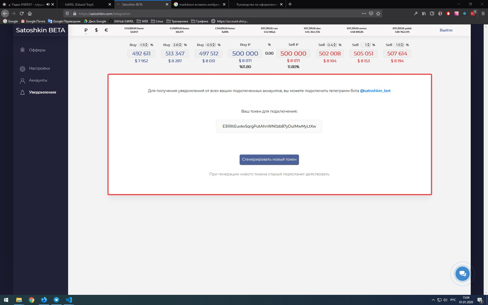
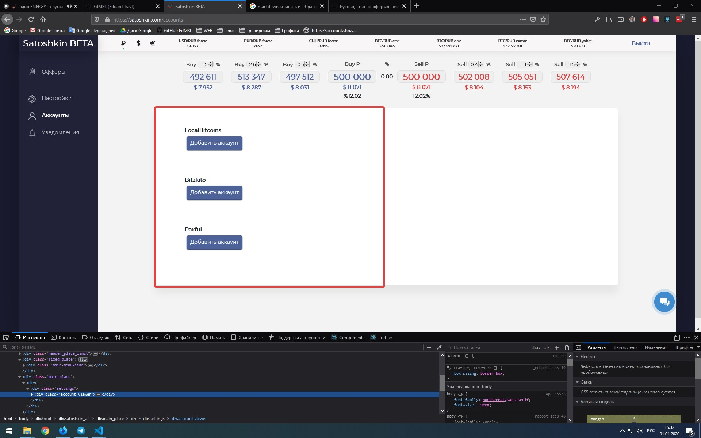
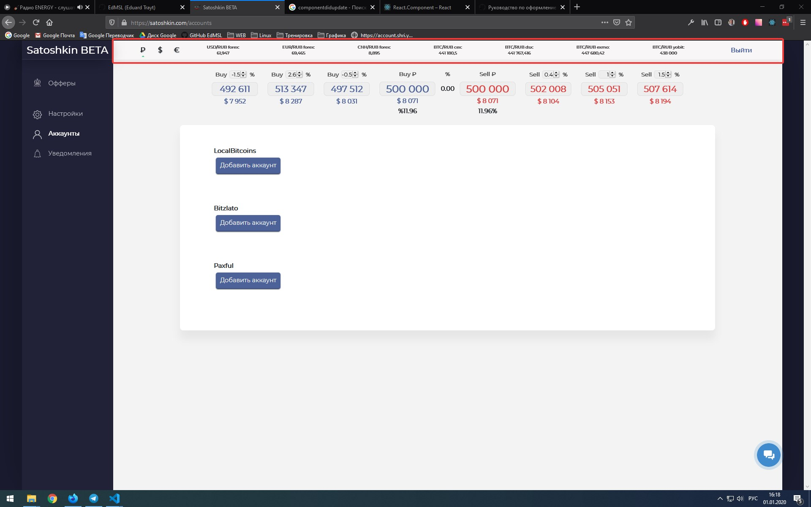

  
Скриншот 1

  

Этот модуль описан в файле src\js\components\satoshkin\settings\Telegramm.js.
Вызывается он в модуле LocalSettings (src\js\components\satoshkin\settings\SatoshkinSettings.js) на 306 строке.
Сам модуль прост. Здесь у нас поле (button.tgToken), которое отображает текущий токен. Токен можно скопировать в буфер обмена, за что отвечает функция copyToClipboard. Есть кнопка, по нажатии которой вызывается функция generateToken, в которой осуществляется http запрос к API на генерацию нового токена.
При монтировании компонент первым делом осуществляет http запрос на получение текущего токена, который сохраняется в state, а оттуда подставляется в поле button.tgToken.

  
Скриншот 2

  

Этот модуль описан в файле src\js\components\satoshkin\accountsPage.js.
Вызывается он в модуле LocalSettings (src\js\components\satoshkin\settings\SatoshkinSettings.js) на 308 строке.
Отвечает за вывод аккаунтов бирж(?) к которым мы подключены. Для каждой биржы вывод доступных аккаунтов осуществляется через state, в котором хранятся данные, которые передаются через пропсы через несколько компонентов, а изначально берутся при монтировании компонента App, когда происходит http запрос к API на их получение. Вывод для каждого подлюченного аккаунта осуществляется с помощью компонента AddKeys, который является модальным окном с нужными для заполнения полями. Есть возможность удалить аккаунт, за это отвечает функция deleteBot. Появляется модальное окно (за него отвечает параметр showDeleteMessage в state) для подтверждения или отмены. При подтвердении идет запрос к API.

  
Скриншот 3

  

Этот модуль описан в файле src\js\components\header\Rates.js.
Вызывается он в модуле Header (src\js\components\header\Header.js) на 36 строке.
Выводит информацию о курсах валют, имеет переключатель и кнопку выхода (компонент Logout). Основа здесь - это функция prepare, которая отвечает за обновление вывода данных о курсах. Если я все правильно понял, то для получения данных используется WebSockets. Данные передаются через пропсы, при изменении курса функция prepare обновляет свойство rates в state и происходит обновление вывода. Так же вывод изменятся при переключении типа валюты (функция changeCur).
